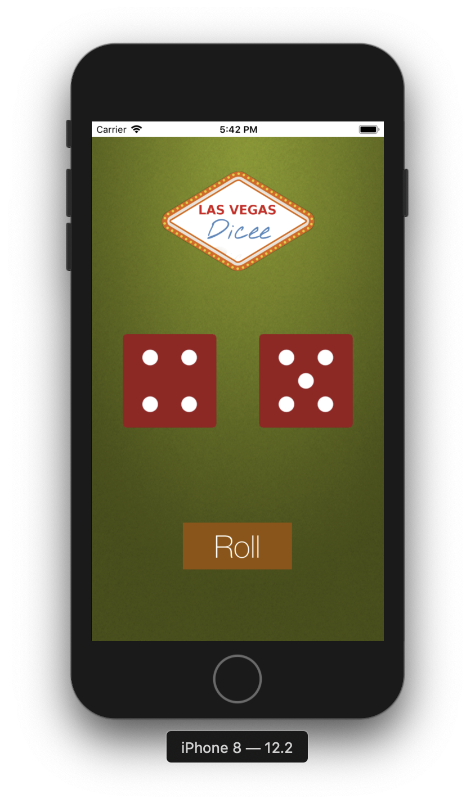

# An iPhone App Named: *Dicee*
This is *second practise project* for iOS app development course.

__What I have learned here:__
1. IBOutlets & IBActions,
2. Variables, Constants & Data types,
3. Randomisation,
4. Arrays,
5. Functions & Motion detection,

___
__Screenshot:__

